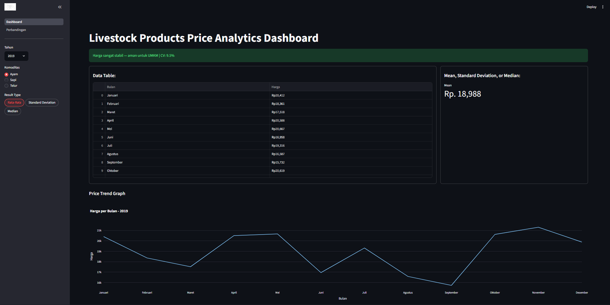
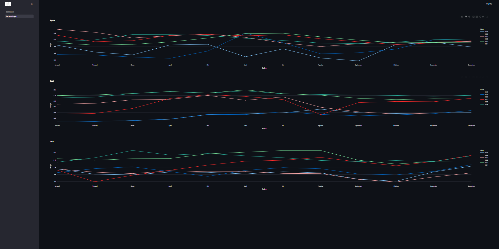

# Livestock-Products-Price-Analytics
My First GitHub Personal Project
Interactive Dashboard for Livestock Price Analytics, using data from BPN (Badan Pangan Nasional). 
Features: 
1.	Trend Visualization 
2.	Price Stability Analysis using Coefficient of Variation 
3.	Price comparison between years in graph 
4.	Sidebar filters for year and commodity selection 
5.	Results of mean, median, and standard deviation is also being shown 

Tech Stack: 
1.	Python 
2.	Streamlit 
3.	Pandas 
4.	Plotly 
5.	Numpy 

How to run: 
python -m streamlit run ep1.py 

Project Structure: 
1.	ep1.py for entry point and navigation 
2.	PersProject.py for the main dashboard 
3.	perbandingan.py for multi-year comparison charts 
4.	BPNCSV.csv livestock price dataset from BPN 
5.	ERD.png is the Flowchart 

CV Value interpretation:
1.	For CV<=10%, the status is really safe, hence the description is “Price is very stable”. 
2.	For 10%<CV<25%, the status is safe, hence the description is “Price is fluctuating moderately”. 
3.	For CV>25%, the status is not safe, hence the description is “Price is highly volatile” 

Data Source: BPN (Badan Pangan Nasional), Indonesia

Preview:

